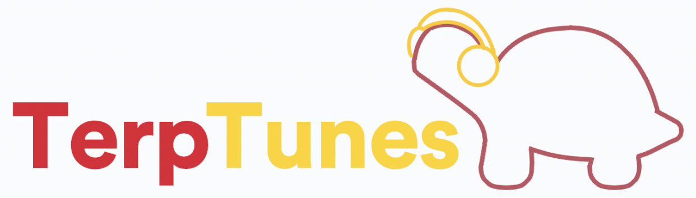

  
   

<h3 align="center">Terp Tunes</h3>

<!-- ABOUT THE PROJECT -->
## About The Project
Terp Tunes is a web app that displays shared music taste across campus communities! It is designed to connect students among campus through music. It allows users to see the top tracks and artists at their school and how similar their taste is to their peers.

### Built With

* [![React][React.js]][React-url]
* [![Javascript][JS.js]][JS-url]
* [![HTML][HTML.com]][HTML-url]
* [![CSS3][CSS.com]][CSS-url]

## Running the example

From a console shell:

    $ npm start

Then, open `http://localhost:3000` in a browser.

## Contact

<!-- MARKDOWN LINKS & IMAGES -->
<!-- https://www.markdownguide.org/basic-syntax/#reference-style-links -->
[product-screenshot]: logo.png
[React.js]: https://img.shields.io/badge/React-20232A?style=for-the-badge&logo=react&logoColor=61DAFB
[React-url]: https://reactjs.org/
[JS.js]: https://img.shields.io/badge/javascript-%23323330.svg?style=for-the-badge&logo=javascript&logoColor=%23F7DF1E
[JS-url]: https://JavaScript.com/
[HTML.com]: https://img.shields.io/badge/html5-%23E34F26.svg?style=for-the-badge&logo=html5&logoColor=white
[HTML-url]: https://html.com/
[CSS.com]: https://img.shields.io/badge/css3-%231572B6.svg?style=for-the-badge&logo=css3&logoColor=white 
[CSS-url]: https://www.w3.org/Style/CSS/Overview.en.html#

